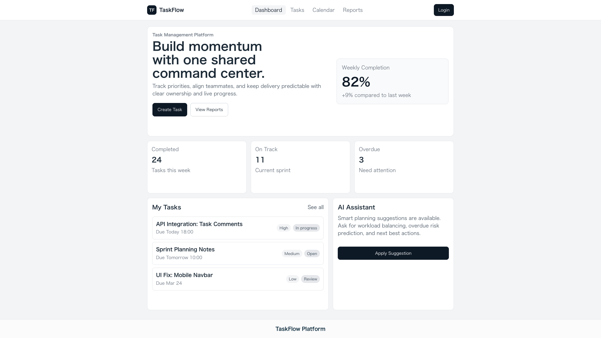

# Software-Engineering-Project

## Project Requirements:

- User Authentication & Profiles
  - Develop the login, registration, and user management features. Ensure secure storage of user data.
- Task Creation and Management
  - Create functionalities for adding, editing, and deleting tasks. Design task categories. Store time taken to complete a task. Implement deadlines and recurring tasks.
  - Implement commenting, file attachment, and sharing features within tasks. Ensure real-time updates for collaboration.
- Progress Tracking
  - Create dashboards that visualize task progress and metrics. Develop reports for individual and team performance.
- Search and Filtering
  - Implement search functionalities for tasks and users. Create filters and different task statuses and categories.
- User Interface
  - Focus on the overall user interface and user experience (UI/UX). Ensure the app is responsive and intuitive, using a modern framework (e.g., React).
- Database
  - Database management, data handling and security measures.
---
## Software Used

**Authentication:** [Firebase](https://firebase.google.com/)

**Storage:** [Google Cloud Storage via Google Cloud Storage, Firebase, Azure, Amazon, Dropbox](#)

**Hosting:** [Netlify or Vercel](#)

**Code Versioning and Featuring:** [Github](https://github.com/)

**Task Manager for project:** [Jira](https://www.atlassian.com/software/jira)

**Database:** [Neon](https://neon.com/)

**Artificial Intelligence:** [Zai-org/GLM-5.1 (Hugging Face)](https://huggingface.co/zai-org/GLM-5.1)

## Frontend: Kazuya & Alex
**Frontend tools used:**
- [React](https://react.dev/)
- [Typscript](https://www.typescriptlang.org/)
- [Vite](https://vite.dev/)

## Backend: Matthew
**Backend tools used:**
- [Express.js](https://expressjs.com/)
---
## In progress UI (3/21 Kazuya)

